# Google Classroom利用の手引き

## はじめに

Google ClassromはGoogle社の提供しているサービスです。
NUアカウントを使用することで、本学学生と教員との間で課題の出題・質問・オンライン授業（オンデマンド授業）の情報を円滑に進めることが可能になります。
教員はクラスの作成、課題の配布、質問の受付、質問への回答など、全てを１箇所で管理できます。ClassroomはGoogleドライブやYoutube等と連携して運用することができます。

[教員はこちら](https://www.youtube.com/watch?v=M6L-nZGIUTE)
もしくは [google classroom ヘルプ](https://support.google.com/edu/classroom/answer/6020279?hl=ja)へ

---

## Classroomの利用に必要なもの

* NUアカウント(   @g.nihon-u.ac.jp)
* パソコン、スマートフォン、タブレット端末などのインターネットへ接続できる機器
* インターネットに接続できる環境

---
## Google Classroomへの参加

Google Classroomへの参加は簡単です。
NU アカウントをお持ちの皆さんはWebブラウザを立ち上げ、GoogleにNU アカウントでログインしていればアプリケーションが提供されています。

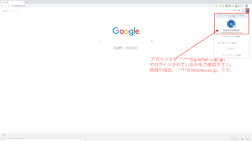

ログインしているアカウントがNUアカウントであることを確認して下さい。
NUアカウント以外のアカウントでは土木工学科のClassroomに参加できません。

Classroomのアプリをクリック。
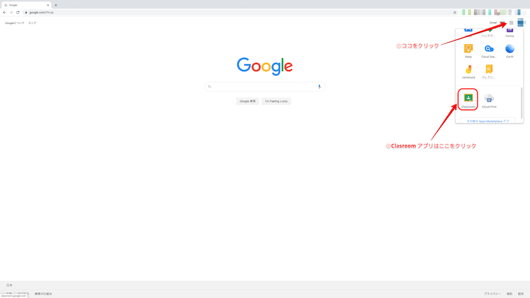

クラスへ参加するためには、右上+印をクリックし、クラスに参加をクリックし
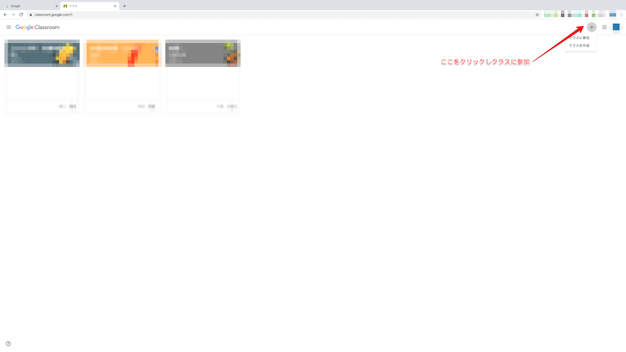

クラスコードを入力して下さい。ここでは、練習用のクラス「vygoxdu」を入力してみましょう。
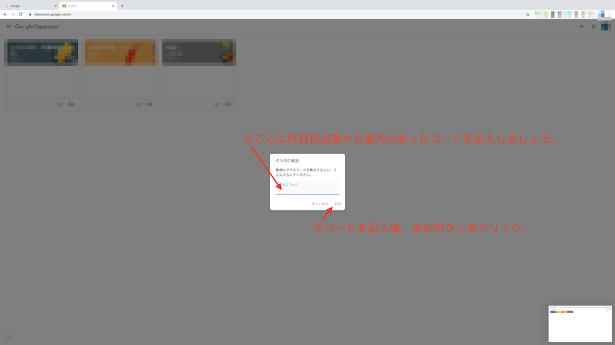

このように、参加しているclassroomが増えます。

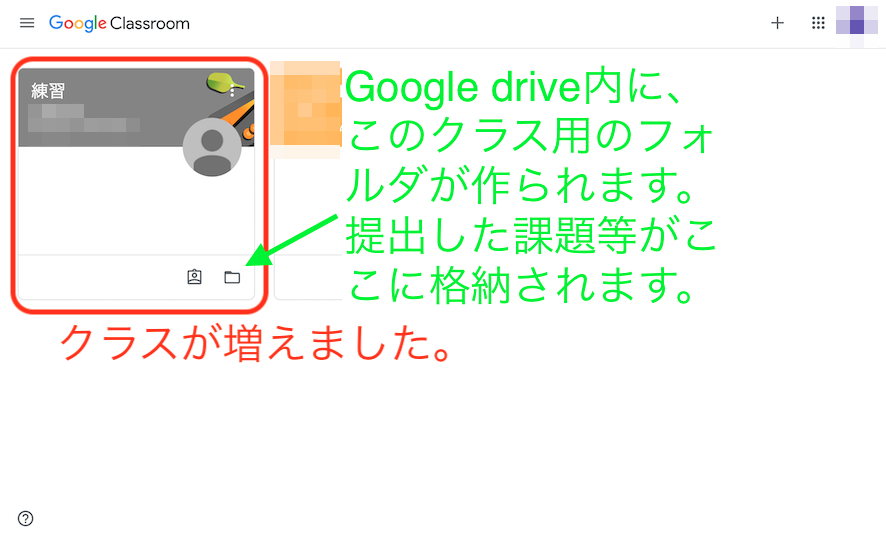

フォルダマークをクリックするとこのclassroom専用のあなたのためのフォルダが作成されています。提出済みの課題等にアクセスできます。

---
## 最新の案内や課題の確認

上部の「ストリーム」をクリックすると、最新の情報・コメント・課題等が掲載されています。

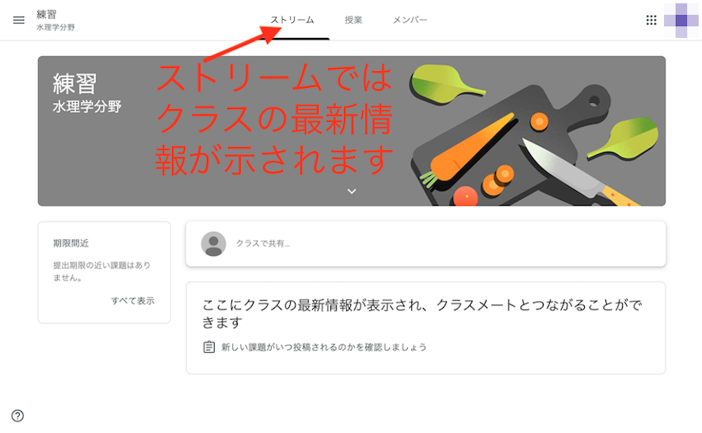

資料・課題が投稿されると、ストリームのここに表示されます。

<!--
クラス全体へのコメントの発信が認められている場合、ストリームからコメントをするとクラス全体に発信することができます。/
/
このようにクラス全体に発信されたことを確認できます。/
/
-->

---
## メンバーの確認

上部の「メンバー」をクリックすると、教師として登録されているメンバーを確認できます。

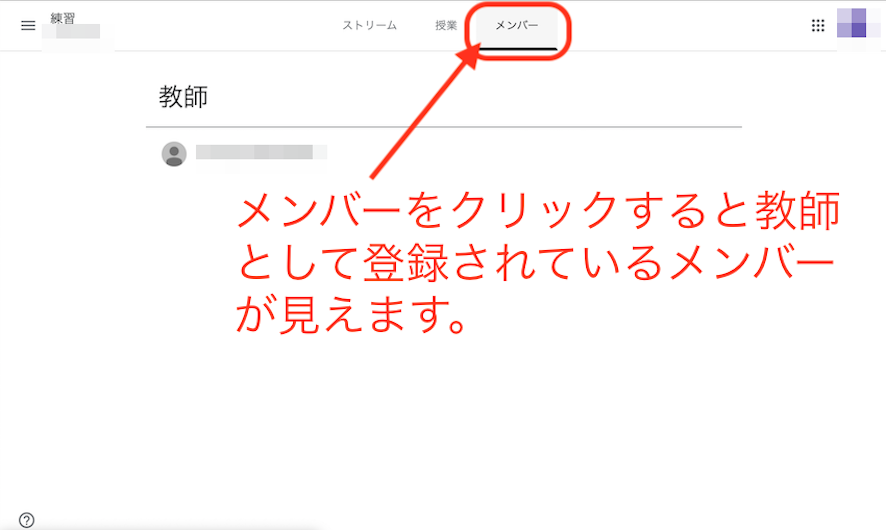

---

## 課題や資料の受領

上部の「授業」をクリックすると、資料・課題・オンライン授業のリンク等が表示されます。
テスト付きの課題も出される場合もあります。
提出期日が指定される場合もありますので、注意下さい。
課題提出の締め切りがある場合、提出日時はサーバーの時計で管理されますので、遅れないように注意下さい。

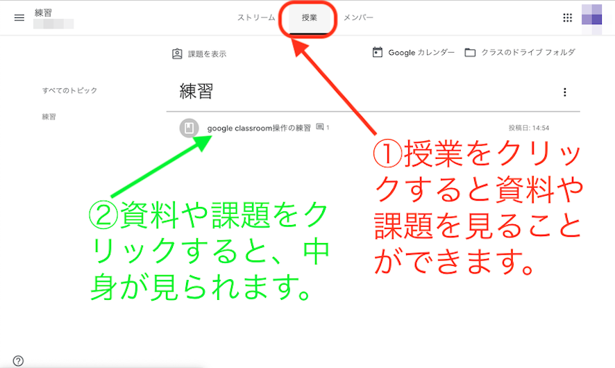

資料・課題をクリックすると、中身が見られます。

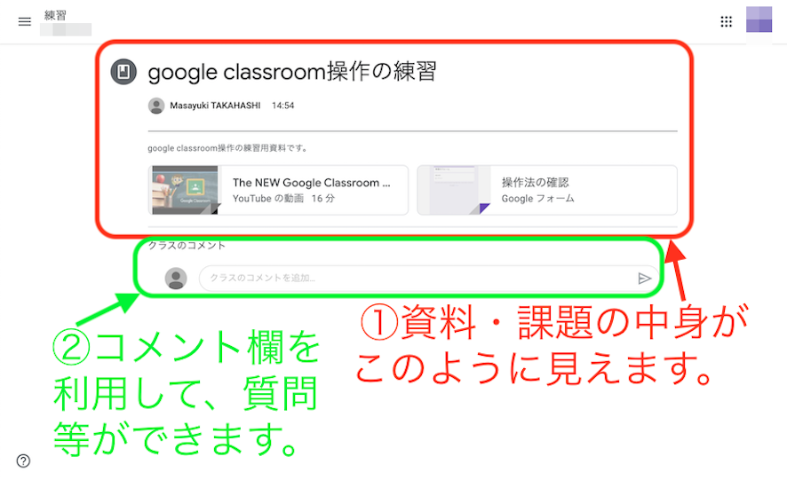

---

## 資料・課題への質問法

### 全体へのコメント

  資料や課題については、クラス全体（教員を含む）に発信できます。

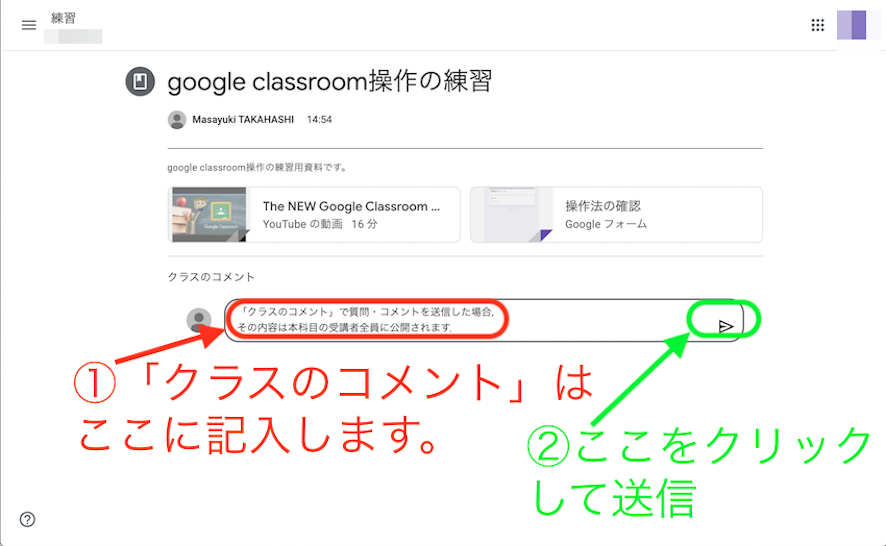

  コメントはこのように公開されます。
  送信後のコメントは三点から編集・削除できます。

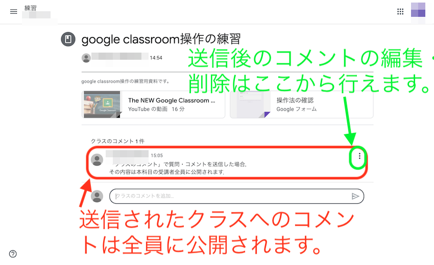

### 個々の質問（課題から可能）

  課題については、宛先を教員に限定した質問をすることができます。

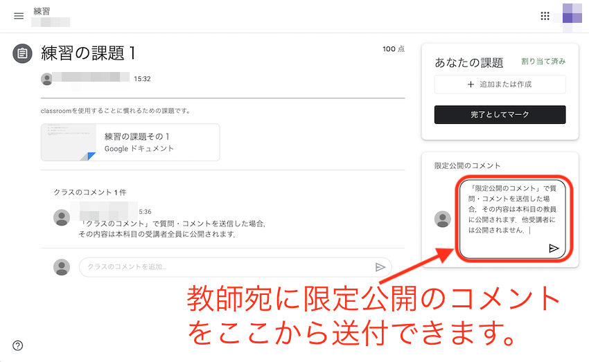

  送信後のコメントは、このように示され、教師と送信者本人のみが見られます。

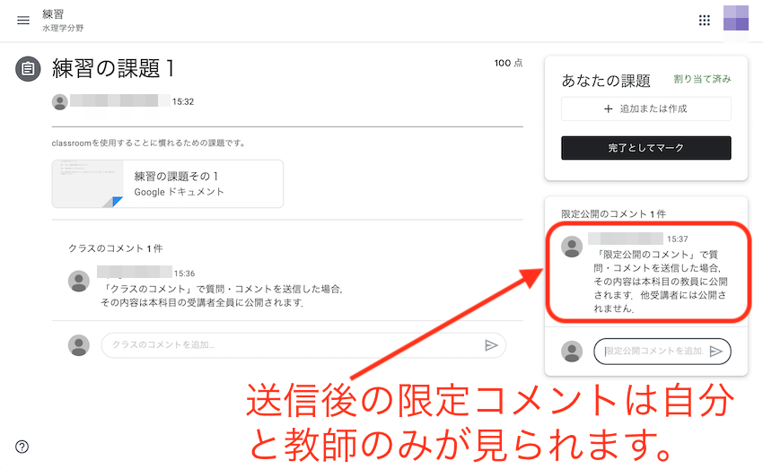

  限定公開コメントへの返信はこのようになされます。

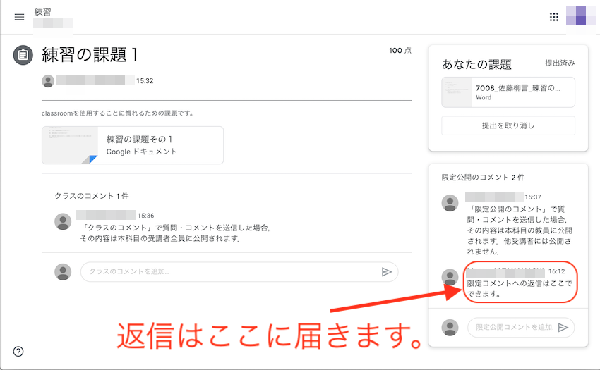

---

## 課題の閲覧・提出方法

課題の閲覧と提出はオンラインで行うことができます。
課題が投稿されると「ストリーム」にこのように示されます。

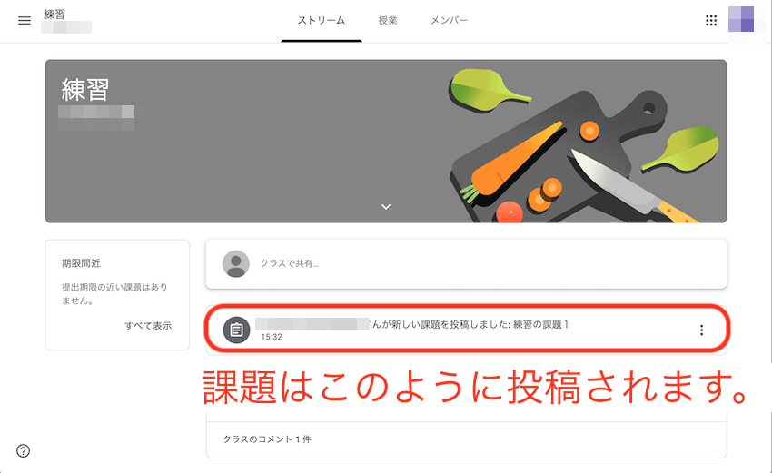

### 課題のダウンロード

課題は「授業」をクリックする、もしくは「ストリーム」の該当課題をクリックすと見ることができます。

課題はこのように示されます。

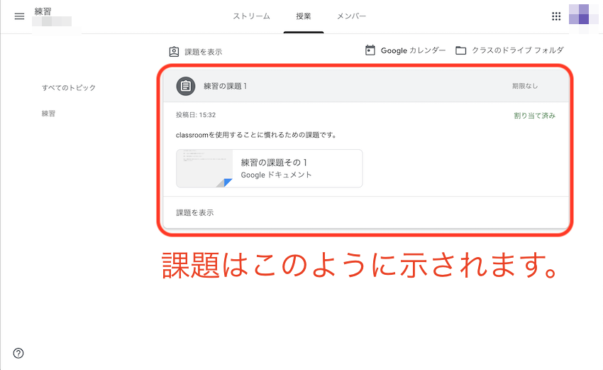

### オンライン講義への参加法

オンライン講義（オンデマンド講義）への参加は以下のようにリンクをクリックすることで参加できます。

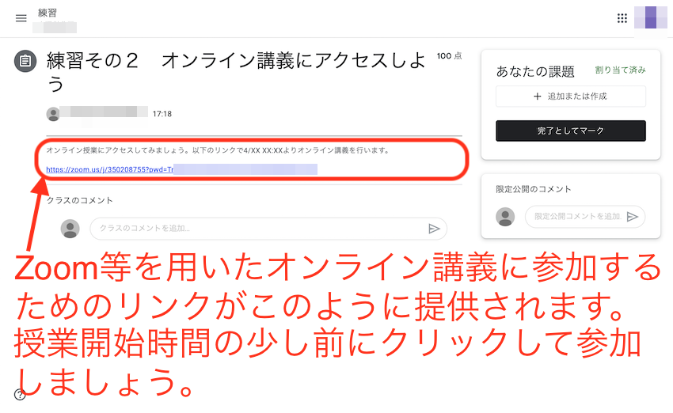

ネットへの接続ができないなどの問題が生じたときのために、授業の動画ファイル（オンデマンド授業）が提供される予定です。
複数回の視聴も可能になる予定です。

### 課題の提出

課題の提出もオンラインで可能です。
課題の作成方法は科目担当者の指示にしたがって下さい。以下の３つの方法が想定されます。

1. 手書きしたレポートをスキャンしてpdfファイル等で提出。
手書きのレポートを電子化して提出するときには、写真で提出することは好ましくありません。
スキャナーの代替となるアプリ(Scanable等)でpdf化して提出しましょう。
2. ワープロソフト、表計算ソフトを利用してファイルを作成し、作成済みファイルを提出。
3. 内容を口述して説明している様子の動画ファイルを提出

どの場合においても、オンラインで電子化されたファイルを提出することができます。
Googleドライブ内のファイルを添付したり、PC内のファイルをアップロードしたりできます。

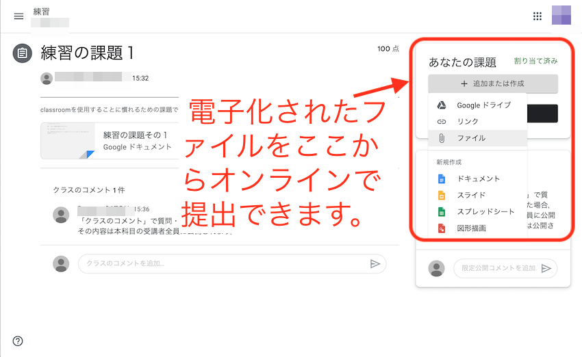

提出用課題のファイルはこのように示されます。
①選んだファイルに誤りがないかを確認し；②提出ボタンをクリックすると課題は提出されます。

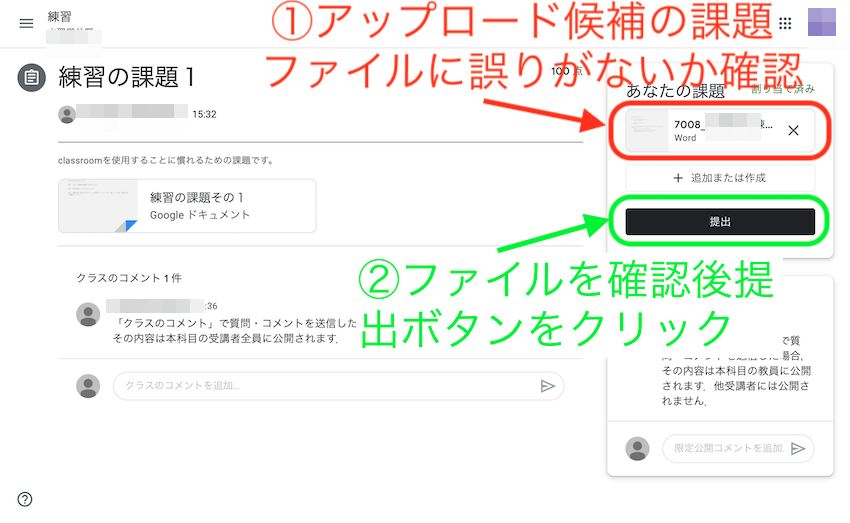

提出済みの課題を確認できます。
提出を取り消すこともできます。

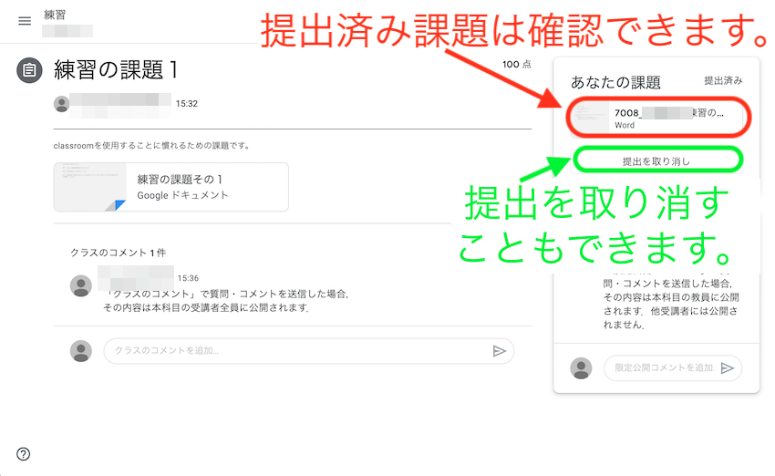
