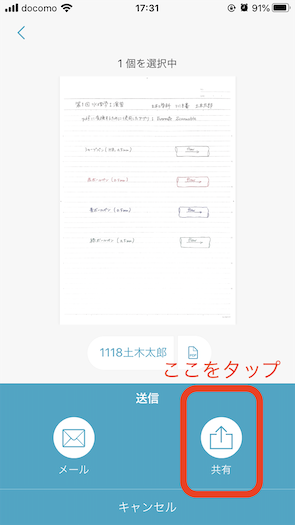

# Google Classroom利用の手引き【[PDF版はこちら](images/classroom/classroom.pdf)】

## はじめに

Google ClassromはGoogle社の提供しているサービスです。
NUアカウントを使用することで、本学学生と教員との間で課題の出題・質問・オンライン授業（オンデマンド授業）の情報を円滑に進めることが可能になります。
教員はクラスの作成、課題の配布、質問の受付、質問への回答など、全てを１箇所で管理できます。ClassroomはGoogleドライブやYoutube等と連携して運用することができます。

[教員はこちら](https://www.youtube.com/watch?v=M6L-nZGIUTE)
もしくは [google classroom ヘルプ](https://support.google.com/edu/classroom/answer/6020279?hl=ja)へ

## すぐに使い始めたい人は以下のリンクから動画をご覧ください。
*[【はじめてのGoogleClassroom #1｜教師 & 生徒編】クラスを作成してみよう](https://www.youtube.com/watch?v=i06HJtajcBA)

土木工学科の学生の練習用クラスのクラスコードは「ssvlluk」です。Google classroomに慣れるために登録してみましょう。

*[【はじめてのGoogleClassroom #2｜教師 & 生徒編】ストリームで情報共有してみよう](https://www.youtube.com/watch?v=aoPt4z8TAe8)

*[【はじめてのGoogleClassroom #3｜教師 & 生徒編】質問の配布と回収](https://www.youtube.com/watch?v=W5fRCO-xj78)

*[【はじめてのGoogleClassroom #4｜教師 & 生徒編】課題の配布と回収](https://www.youtube.com/watch?v=bjlLRZZVOwk)

*[【はじめてのGoogleClassroom #5｜教師 & 生徒編】資料の共有｜トピック｜ToDo](https://www.youtube.com/watch?v=h8L4KKQR7BQ)

*[【はじめてのGoogleClassroom #6｜教師&生徒編】ルーブリック](https://www.youtube.com/watch?v=ID7ZSaikBKw)

*[【はじめてのGoogleClassroom #7｜生徒編】iPad（iOS）での課題提出](https://www.youtube.com/watch?v=9-XWDPkKEXE)

---
# Classroomでできること

## Classroomを用いると次のようなことができます。

* [講義・演習・実験・実習などの科目のお知らせのチェック](#stream)
* [科目の授業への入室](#jyugyou)
* [オンライン講義への参加](#online)
* [メンバーの確認](#member)
* [Classroomへの参加（各科目最初の１回）](#register)

### [利用手順はこちら](#register)
### [課題の閲覧方法はこちら](#view)
### [手書きの課題の提出方法はこちら](#submit)
### [授業・課題へ質問したいときはこちら](#QA)
### [科目のコード一覧はこちら](/classcode.md)
### [オンライン授業で困ったときはこちら](#FAQ)

---
# Classroomの利用手順
## Classroomの利用のために用意するもの

* NUアカウント(   @g.nihon-u.ac.jp)。
* パソコン、スマートフォン、タブレット端末などのインターネットへ接続できる機器。
* インターネットに接続できる環境。

---

## Google Classroomへの参加（最初の１回のみ）

Google Classroomへの参加は簡単です。
NU アカウントをお持ちの皆さんはWebブラウザを立ち上げ、GoogleにNU アカウントでログインしていればアプリケーションが提供されています。

ログインしているアカウントがNUアカウントであることを確認して下さい。
NUアカウント以外のアカウントでは土木工学科のClassroomに参加できません。

Classroomのアプリをクリック。

クラスへ参加するためには、右上+印をクリックし、クラスに参加をクリックし

クラスコードを入力して下さい。ここでは、練習用のクラス「ssvlluk」を入力してみましょう。

このように、参加しているclassroomが増えます。

フォルダマークをクリックするとこのclassroom専用のあなたのためのフォルダが作成されています。提出済みの課題等にアクセスできます。

---

# 科目のお知らせのチェック

## 最新の案内や課題の確認

上部の「ストリーム」をクリックすると、最新の情報・コメント・課題等が掲載されています。

資料・課題が投稿されると、ストリームのここに表示されます。

<!--
クラス全体へのコメントの発信が認められている場合、ストリームからコメントをするとクラス全体に発信することができます。/
/
このようにクラス全体に発信されたことを確認できます。/
/
-->

---

# 科目の授業への入室

## 授業への入室の方法
上部の**「授業」をクリック**すると、指定した授業へ入室できます。
授業の中では、資料・課題・テストなどを閲覧・提出ができます。

## 科目ごとの部屋でできること

* 資料・課題の受領と提出ができます。

上部の「授業」をクリックすると、資料・課題・オンライン授業のリンク等が表示されます。
テスト付きの課題も出される場合もあります。
提出期日が指定される場合もありますので、注意下さい。
課題提出の締め切りがある場合、提出日時はサーバーの時計で管理されますので、遅れないように注意下さい。

資料・課題をクリックすると、中身が見られます。

## 課題の閲覧・提出方法

課題の閲覧と提出はオンラインで行うことができます。
課題が投稿されると「ストリーム」にこのように示されます。

### 課題のダウンロード

課題は「授業」をクリックする、もしくは「ストリーム」の該当課題をクリックすと見ることができます。

課題はこのように示されます。

### 課題の提出

課題の提出もオンラインで可能です。
課題の作成方法は科目担当者の指示にしたがって下さい。以下の３つの方法が想定されます。

1. [手書きしたレポートをスキャンしてpdfファイル等で提出](#submit)。
手書きのレポートを電子化して提出するときには、写真で提出することは好ましくありません。
スキャナーの代替となるアプリ(Scanable等)でpdf化して提出しましょう。
2. ワープロソフト、表計算ソフトを利用してファイルを作成し、作成済みファイルを提出。
3. 内容を口述して説明している様子の動画ファイルを提出

どの場合においても、オンラインで電子化されたファイルを提出することができます。
Googleドライブ内のファイルを添付したり、PC内のファイルをアップロードしたりできます。

提出用課題のファイルはこのように示されます。
①選んだファイルに誤りがないかを確認し；②提出ボタンをクリックすると課題は提出されます。

提出済みの課題を確認できます。
提出を取り消すこともできます。

---

# 手書きレポートをpdfファイルに変換してGoogle classroomに提出する方法

**インストールしておくアプリ**

* Google drive
* Google classroom
* pdf変換できるスキャンアプリ
	* Evernote Scannable (iOS対応)
	* Google drive (Android対応)
	* Microsoft Lens|PDF Scanner (iOS, Android対応)　など

---

## 手書きレポートをpdfファイルに変換し，保存する

### Evernote Snannableを使用する場合（iOS対応機種におすすめ）

1.
Evernote Scannableのアプリを開き，手書きレポートを暗い色の机や床などの平らな場所に置き，スキャンする．

2.
スキャンされたファイルのファイル名と形式を，
 * ファイル名：学生番号+氏名
 * ファイル形式:pdfファイル(.pdf)
のように変更する（例：1118土木太郎.pdf）．

変更後，「送信」を選択し，「共有」を選択すると，

Google driveのアイコンが表示される．

3.
Google driveのアイコンをタップすると，スキャンしたpdfファイルが表示される．
このとき，画面下に表示されるアカウント名がNUアカウント(   @g.nihon-u.ac.jp)であることを確認する．

4.
画面下の「ファイルを選択」をタップすると，

が表示される．

5.
「マイドライブ」を選択，

「Classroom」を選択，

「クラス名（画像では水理学I演習（2年生）水理学）」を選択

すると，

が表示される．
画面右下の「ここに保存」をタップすると，

の画面が表示される．
保存先のフォルダが提出先のクラスになっていることを確認する．
確認した後，画面右上の「アップロード」を選択すると，ファイルがGoogle drive内の指定したフォルダに保存される．

6.
アップロードが完了すると，

の画面が表示されるので，「完了」をタップしてScannableのアプリを閉じる．

---
### Google driveを使用する場合（Android対応機種におすすめ）

1.
Google driveのアプリを開き，
「マイドライブ」を選択 ，

，

「Classroom」を選択，

，

「クラス名（画像ではClassroom練習用）」を選択

する．
最後に開かれたフォルダ内に新規作成するファイルが保存される．

2.
画面右下の「＋」ボタンをタップすると，新規作成のページが表示される．

右側の「スキャン」を選択すると，カメラ機能に切り替わ理，機種によっては

のように表示される．
その後，資料をスキャンする．

3.
画面右上のパレットアイコンをタップすると，

のように撮影したい画像のモノクロ or カラーを選択できる．

4.
スキャンする資料が2枚以上ある場合は，画面右下の「＋」をタップする．
スキャンを終えて画面右下のチェックマークを選択すると，ファイルが保存される．

5.
保存されたファイルのファイル名を，
 * ファイル名：学生番号+氏名
のように変更する（例：1118土木太郎.pdf）．

<!--
---
### Microsoft Lens|PDF Scannerを使用する場合
-->

---
## pdfファイルをGoogle classroomに提出する

1.
Google classroomのアプリを開き，提出したい課題の画面を表示する．

画面下の「あなたの課題」の「＾」をタップすると，

が表示される．

2.
「添付ファイルを追加」をタップし，

の画面で「ドライブ」を選択し，レポートのpdfファイルを保存したGoogle drive内のフォルダを開く．

3.
提出するpdfファイルを選択すると，

の画面が表示される．
「提出」を選択すると，添付したファイルが提出される．

4.
提出されると，画面右上に「提出済み」と表示される．

---
# Google classroomで返却されたレポートを確認する方法

1.

のように，クラスの「授業」のタブを開く．

画面右上をタップすると，クラスで出題された課題などの一覧が表示される．

2.
確認したい課題を選択すると，次のような画面が表示される．

課題に点数が付けられた場合は，画面右上に点数が表示される．
また，採点の評価基準を設定する機能（ルーブリック）が使用された場合は，画面中央に各項目の評価点が表示される．

次に，Google driveに課題を保存するため，返却された課題をタップする．

3.
返却されたレポートにコメントが投稿されている場合，次の画像のように該当箇所は黄色で示される．

画面右上のアイコンをタップすると，Google driveのページに切り替わる．

コメントの内容は，切り替わったGoogle driveのページで確認することができる．

4.
画面右上のアイコン，もしくは，コメントを確認したい箇所をタップすると，次の画面のようにコメントが表示される．

コメントの内容を解決できた場合は「解決」をタップし，コメントに対して返信したい場合は「返信」をタップする．

5.
「解決」をタップした場合，次の画面が表示される．

6.
「解決」をタップした後，返却されたファイルを確認すると，解決前に黄色で示されていた箇所が無くなる．
画面右上のアイコンをタップすると，すべてのコメントの履歴を確認することができる．

---

* 質問の提出をすることができます。また、回答も届きます。

* [Androidでの課題の提出方法のヘルプ](https://support.google.com/edu/classroom/answer/6020285?co=GENIE.Platform%3DAndroid&hl=ja)はこちら
* [パソコンでの課題の提出方法のヘルプ](https://support.google.com/edu/classroom/answer/6020285?co=GENIE.Platform%3DDesktop&hl=ja)はこちら
### 全体へのコメント

  資料や課題については、クラス全体（教員を含む）に発信できます。

  コメントはこのように公開されます。
  送信後のコメントは三点から編集・削除できます。

  ストリーム（掲示板）から共通的な質疑を行うことができます。

### 個々の質問（課題から可能）

  課題については、宛先を教員に限定した質問をすることができます。

  送信後のコメントは、このように示され、教師と送信者本人のみが見られます。

  限定公開コメントへの返信はこのようになされます。

---

## メンバーの確認

上部の**「メンバー」をクリック**すると、教師として登録されているメンバーを確認できます。

---

### オンライン講義への参加法

オンライン講義（オンデマンド講義）への参加は以下のようにリンクをクリックすることで参加できます。

ネットへの接続ができないなどの問題が生じたときのために、授業の動画ファイル（オンデマンド授業）が提供される予定です。
複数回の視聴も可能になる予定です。

---

### よくある質問はこちら
1. クラスコードを忘れてしまいました。

   CSTポータルで該当科目を見てみましょう。
<!--クラスコードが見つからなければ、[こちらを見て下さい](/classcode.md)。-->

それでも見つからなければ、科目担当者にメールで問い合わせをしましょう。
2. 動画は授業時間以外に視聴しても良いですか。

  オンライン授業の場合は、配信時間に視聴することをお勧めします。理由は、質問が生じた場合に、チャット機能等でその場での質問が可能なためです。
3. 動画の視聴回数は複数回可能ですか。

  複数回可能の予定です。理由は、ネット環境が不安定な場合でも、複数回視聴することで聞き取れるように配慮しています。
