# 小テスト実施システム　概要

このシステムは、以下の機能を有します。
* 教員によりあらかじめ用意された問題群の中から、
* 教員が取り上げる問題、有効時間、問題を開くパスコードを指定し、
* 学生が自らのスマートフォンを用いて小テストに回答
* 回答結果は、学生は解説画面を見ることができ、教員は回答のグラフを教室で表示することができる。
* また、授業科目ごとに、数回行った科目の全学生の解答状況をエクセルでダウンロードできる。
* 問題や解説に画像を用いることができます(画像ストレージのamazon S3を解約してしまったので、いまは動きません)

以下、操作イメージを示します。

## トップ画面

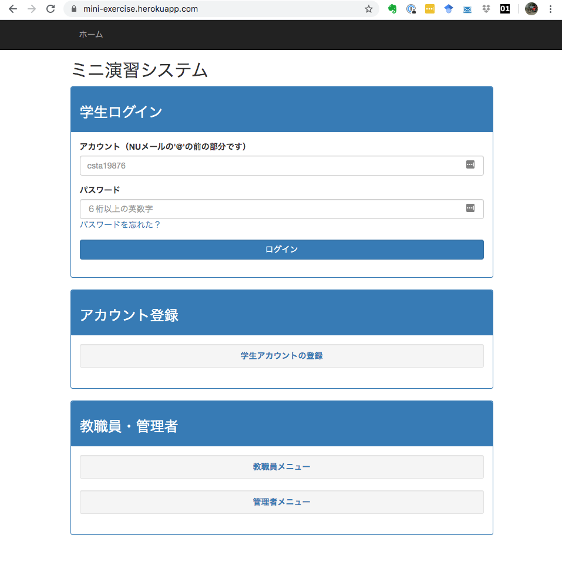

* 学生ログイン画面ですが、教員・管理者メニューへのリンクも含みます。
* メールアドレス（学生は＠の前のアカウント部分）とパスワードでログインします。
* パスワードを忘れた場合は、パスワードリセット機能があります（リセット確認メールが送られる）。

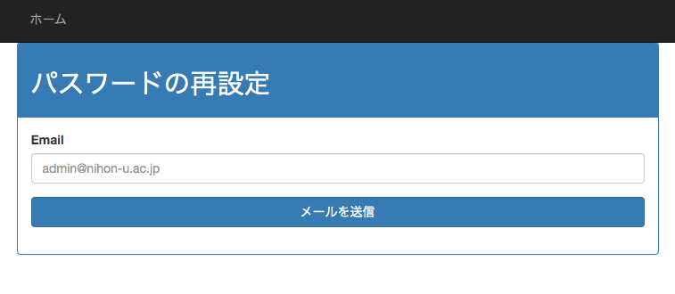
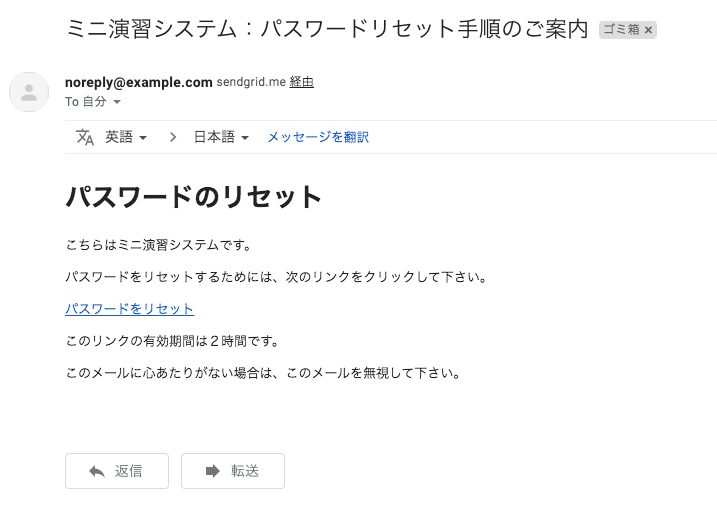

## 教員
### ログイン
サイトトップ下部の教職員メニューからログインします。

現在は、中村しか登録されていないので、次の情報でログインしてください。
* URL： https://mini-exercise.herokuapp.com
* メールアドレス：nakamura.hideo74@nihon-u.ac.jp
* パスワード：111111 （半角の1を6つ）

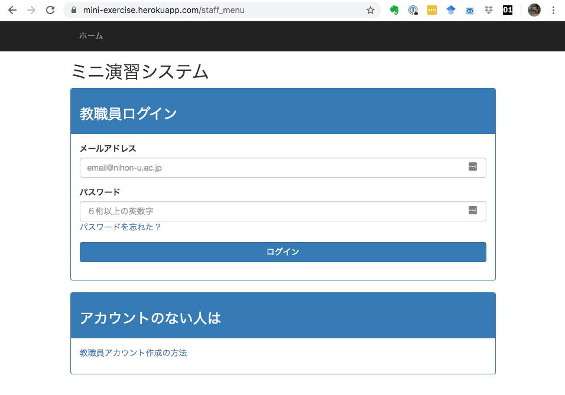

### ログイン後の教員トップ画面

現在登録されている科目の一覧と、問題一覧が表示されます。

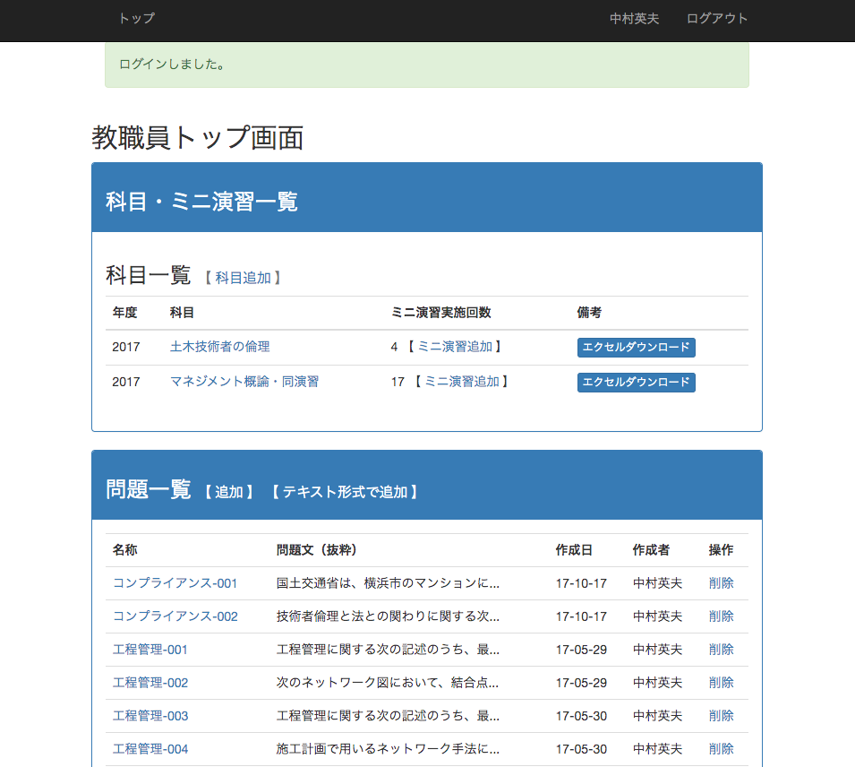

### 授業科目の追加

2020年度の授業用の科目を追加してみましょう。科目一覧タイトルの右にある[科目追加]をクリックすると、科目の新規作成画面になります。

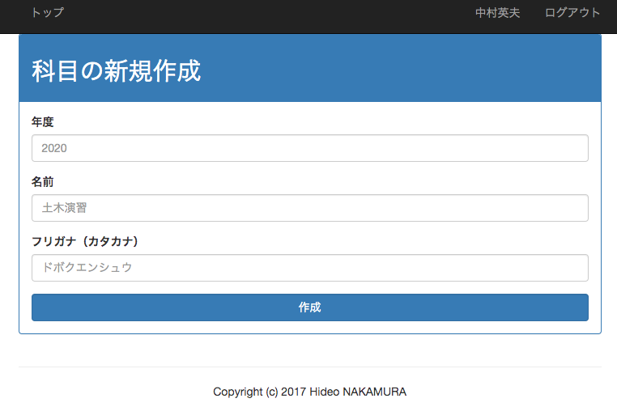

必要事項を入力して作成すると、科目一覧に「2020 土木技術者倫理」が追加されています。
(ミニ演習実施回数が1になっているのは、画面キャプチャをし忘れて後で撮り直したからです)

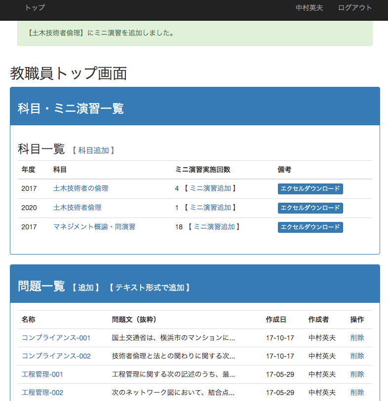

### 問題の追加

「2020 土木技術者倫理」の行にある[ミニ演習追加]をクリックすると、問題作成画面に遷移します。

科目名、作成した教員名、問題名、問題を解かせる時刻、解かせるときに入力させるパスコードを入力します。パスコードは、教室にいないと回答できないようにするための措置です。実際は、LINEなどで伝えられたら無力ですけれど、多少の抑止にはなるでしょう。

### 問題の実施状況

科目名をクリックすると、当該科目の問題の実施状況が表示されます。

現在は1問しかなく、しかも誰も回答していないので、受験者・正解者数とも0になっています。また、備考欄では、この問題に設定したパスコードが表示されています。もしも早目に回答時間を切り上げる場合は「終了」ボタンを押します。

下段の「学生一覧」のブロックには、この科目に登録した学生リストが表示されます。今回は、まだ誰も登録していないので、表示されていません。

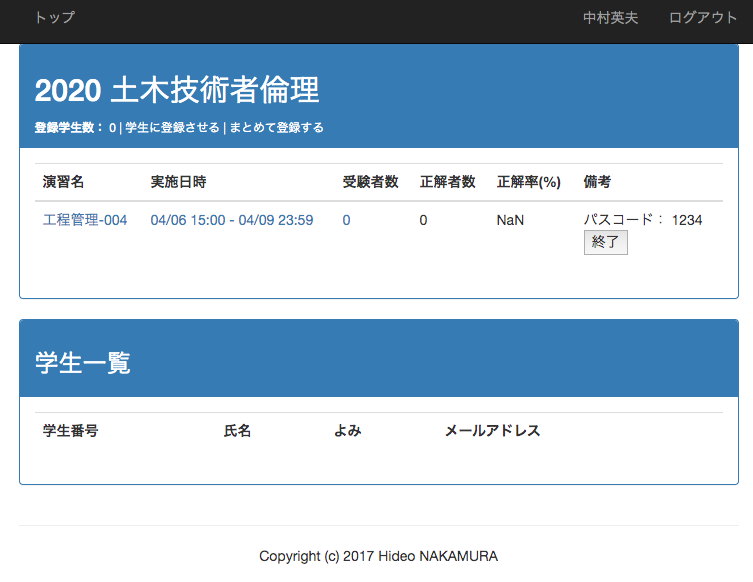

この画面で問題名「工程管理ー004」をクリックすると、回答状況のグラフが表示されます。下図は別の問題の例です。

問題作成画面は今回は割愛しますが、作成した問題は次のように、「本文」「選択肢」「正答」「解説」からなります。この例では全体に対する解説をする例ですが、選択肢ごとに解説をする形式も可能です。

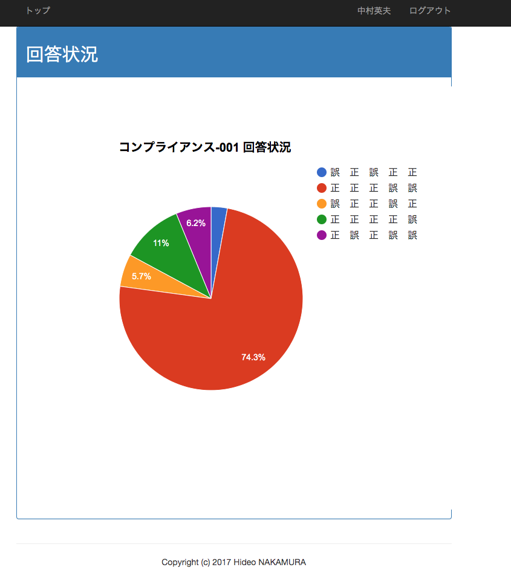

また、教職員トップ画面の科目名の一番右にある「エクセルダウンロード」をクリックすると、次のようなエクセルを入手できます。

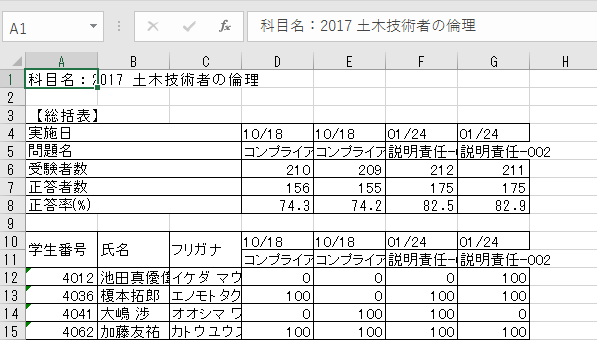

## 学生

### ログイン

つぎの画面からログインします。

### 学生トップ

ログインすると、「登録科目」、「登録可能な科目」、現在回答することができる「有効なミニ演習」、「回答済みの演習一覧」が表示されます。

有効なミニ演習は「今はありません。」と表示されています。

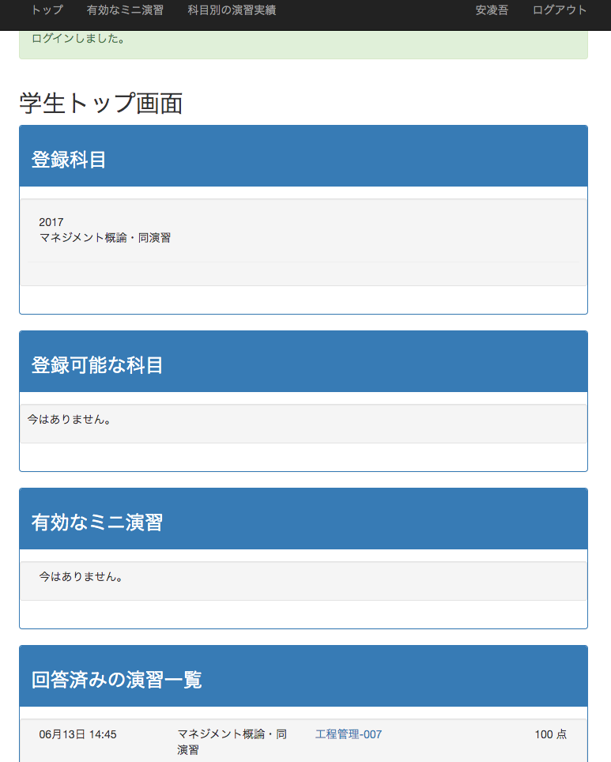

### ミニ演習に回答する

教員が設定した回答時刻内であれば、次の画面のように有効なミニ演習が表示されます。
表示されるのは、回答可能時間帯、科目名、演習名、そしてパスコード入力欄です。

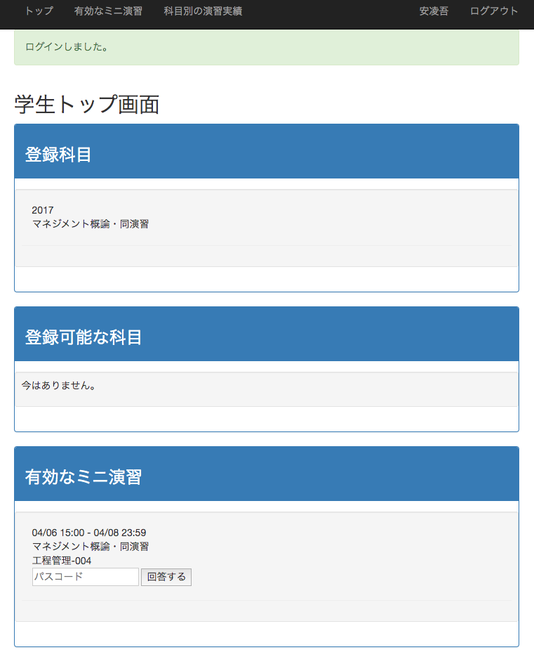

教員から示されたパスコードを入力すると、問題画面に遷移します。当然ですが、正答や解説はまだ表示されません。また、選択肢の順序はランダムに表示されます。拡散された正答番号を入力しても無意味だ、とするためです。

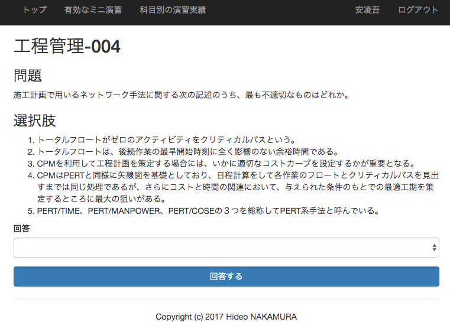

回答はプルダウンで選択します。

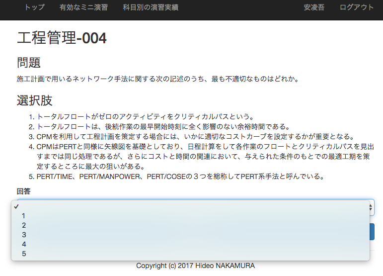

間違えると、画面上部にアラートが表示されます。

正誤にかかわらず、正答、あなたの回答、解説が表示されます。

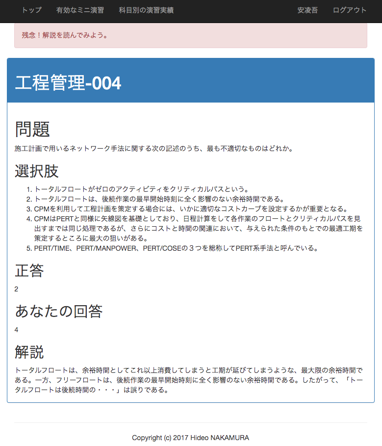
